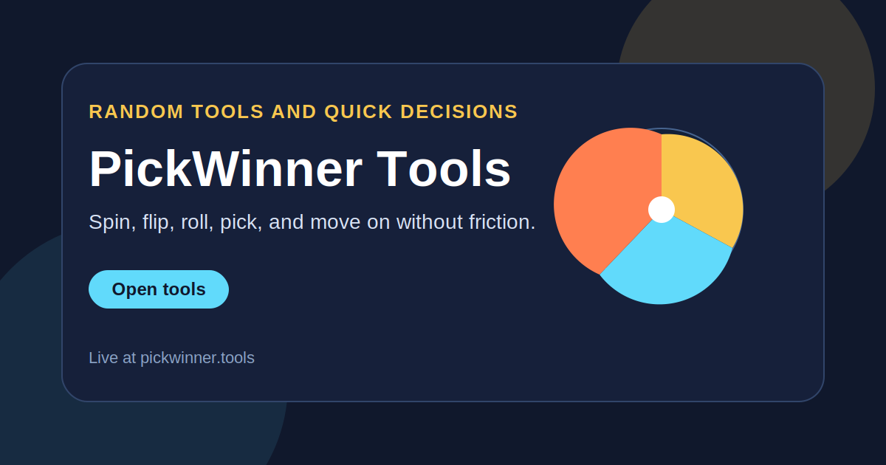

<h1 align="center">PickWinner Tools</h1>

  A fast collection of randomizers and quick-decision tools built for zero-friction use in the browser and in lightweight extensions.

  <a href="https://pickwinner.tools/"><strong>Open Website</strong></a>
  ·
  <a href="https://github.com/ivanlukichev/pickwinner"><strong>GitHub Repo</strong></a>
  ·
  <a href="https://microsoftedge.microsoft.com/addons/detail/pickwinner-tools-coin-fli/jkpbnijgddlpjkkjjjdfcemfcgblgjnk"><strong>Edge Extension</strong></a>

  

## What It Is

PickWinner Tools is a utility product for moments when a fast neutral answer is more useful than a complex app. It bundles coin flips, dice, random numbers, name pickers, team generators, wheels, and similar micro-tools into one lightweight browser experience.

This public repository is meant to explain the product at a glance, link the live tools, and expose a curated source snapshot from the active private development repo.

## Included Source Snapshot

This repo now contains real project files, not just a showcase page:

- `deploy/` with the production website pages, styles, scripts, redirects, and SEO files
- `scripts/` with local preview and deploy validation helpers
- `wrangler.jsonc` for Cloudflare deploy routing
- `extension/` with browser-extension packages and related docs
- `docs/` with project audit and public-repo notes

Excluded on purpose:

- `.env*`
- `.wrangler/`
- `backups/`
- local caches and temp files

## Included Tools

- coin flip
- dice roller
- random number generator
- random name picker
- team generator
- spin the wheel
- pick a card
- pick a door
- mystery box picker

## Browser Extensions

The repository also contains extension packages for the coin flip tool:

- Shared source: [extension/src](https://github.com/ivanlukichev/pickwinner/tree/main/extension/src)
- Chrome package: [extension/chrome](https://github.com/ivanlukichev/pickwinner/tree/main/extension/chrome)
- Firefox package: [extension/firefox](https://github.com/ivanlukichev/pickwinner/tree/main/extension/firefox)
- Edge package: [extension/edge](https://github.com/ivanlukichev/pickwinner/tree/main/extension/edge)
- Opera package: [extension/opera](https://github.com/ivanlukichev/pickwinner/tree/main/extension/opera)
- Privacy policy: [extension/privacy-policy.md](https://github.com/ivanlukichev/pickwinner/blob/main/extension/privacy-policy.md)

## Why It Feels Different

- Each tool is focused on one small job and opens fast.
- The product feels useful without requiring accounts or setup.
- Website and extension fit the same simple decision-making use case.
- The public repo doubles as a clean product landing page.

## Project Snapshot

- Category: randomizers and utility tools
- Audience: casual users, streamers, teachers, teams, decision helpers
- Stack: static web tools plus lightweight browser extensions
- Product goal: solve quick choice problems with minimal friction
- Repo role: public product page plus safe source snapshot

## More Projects

| Project | Live site | Public repo |
| --- | --- | --- |
| PickHeadphones | [pickheadphones.com](https://pickheadphones.com/) | [PickHeadphones](https://github.com/ivanlukichev/PickHeadphones) |
| HTTPTools | [httptools.net](https://httptools.net/) | [HTTPTools](https://github.com/ivanlukichev/HTTPTools) |
| CalcSprint | [calcsprint.com](https://calcsprint.com/) | [CalcSprint](https://github.com/ivanlukichev/CalcSprint) |
| Number Hunt | [numberhuntgame.com](https://numberhuntgame.com/) | [numberhuntgame](https://github.com/ivanlukichev/numberhuntgame) |
| Sudoku Play | [sudoku-play.org](https://sudoku-play.org/) | [Sudoku-Play](https://github.com/ivanlukichev/Sudoku-Play) |
| PlayMathPuzzles | [playmathpuzzles.com](https://playmathpuzzles.com/) | [PlayMathPuzzles](https://github.com/ivanlukichev/PlayMathPuzzles) |
| Word Chain Game | [word-chain-game.com](https://word-chain-game.com/) | [Word-Chain-Game](https://github.com/ivanlukichev/Word-Chain-Game) |
| BlockPlay | [blockplaygame.com](https://blockplaygame.com/) | [BlockPlay-Game](https://github.com/ivanlukichev/BlockPlay-Game) |

## Visit

  <a href="https://pickwinner.tools/"><strong>Open PickWinner Tools</strong></a> 
  Fast browser randomizers and decision helpers with an extension layer for coin flips.

